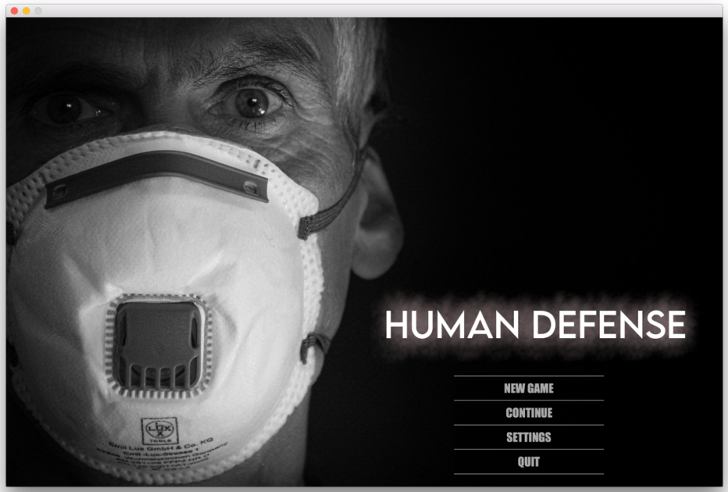
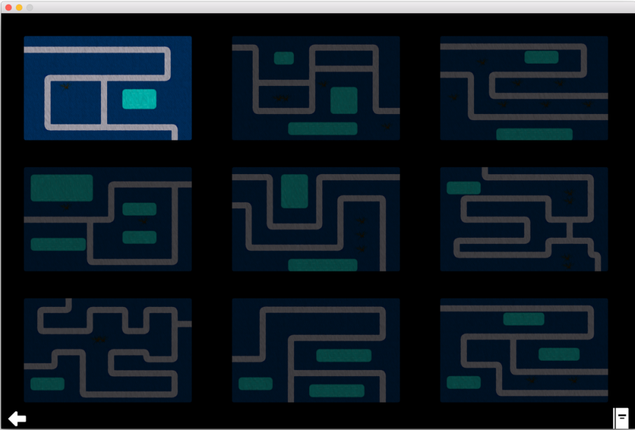

# TowerDefense

  

  

## Tourelles :
- GunTurret : tourelle correspondant à une tourelle classique, avec les attributs communs à toutes les tourelles (vitesse, portée, dégâts, précision, prix d’achat, coût d’amélioration).
- DoubleGunTurret : tourelle munie de deux canons qui envoie deux balles sur les ennemis.
- MachineGun : tourelle classique avec une cadence de tir plus rapide.
- ShotgunTurret : tourelle qui tire en un coup plusieurs balles à la fois sur les ennemis (le nombre de balles dépendant du niveau d’amélioration de la tourelle).
- SniperTurret : tourelle ayant une très grande précision de tir, et munie d’une ligne de visée laser suivant l’ennemi le plus proche.
- CrossbowTurret : tourelle qui tire des flèches sur les ennemis.
- MissileLauncher : tourelle qui envoie des missiles sur les ennemis, provoquant une explosion sur la carte et des dégâts de zone.
- IceTurret : tourelle qui envoie des glaçons qui gèlent les ennemis sur place de façon permanente.
- ElectricTurret : tourelle qui envoie un arc électrique (sous forme d’animation) qui électrocute les ennemis.
- Projectiles : chaque tourelle tire des projectiles, et ceux-ci peuvent varier d’une tourelle à l’autre (balle, flèche, missile, glaçon)
- Orientation des tourelles : chaque tourelle dispose d’un système d’orientation (rotation graphique des tourelles) et de détection de l’ennemi le plus proche.
- Rayon de portée : possibilité d’afficher la portée de chaque tourelle en cliquant dessus (ainsi que ses statistiques).
- Amélioration : système d’amélioration des tourelles adapté à chacune de leurs spécificités. Le niveau d’amélioration est infini, en fonction des ressources.

## Attaques :
- Attaque : les attaques sont divers dispositifs, autres que les tourelles, visant à aider le joueur dans sa partie. Leurs fonctions peuvent être très variées.
- Explosion : attaque permettant de déposer une explosion sur une zone précise de la carte, effectuant des dégâts de zone.
- Mine : attaque permettant de déposer une mine antipersonnel sur la carte, se déclenchant au passage d’un ennemi après un certain délai, et effectuant des dégâts de zone.
- Lightning : attaque permettant de déposer un éclair de courte portée à un endroit précis de la carte.
- Potion : attaque qui permet au joueur de gagner de la vie (suivant son niveau).
- ChemicalAttack : attaque qui dépose un nuage chimique à un endroit précis de la carte, empoissonnant les ennemis (qui perdent de la vie au fil du temps passé en dessous de ce nuage).
- Mower : attaque qui fait surgir une tondeuse (clin d’œil au jeu Plants vs. Zombies) éliminant tous les ennemis rencontrés sur son chemin.
- LockDown : attaque qui, dans un premier temps, ne fait rien, et au fil des améliorations, peut faire perdre de la vie à tous les ennemis présents sur la carte, faire gagner de la vie (score qui augmente) au joueur, ou lui faire gagner de l’argent.
- Amélioration : système d’amélioration des attaques adapté à chacune de leurs
- spécificités. Le niveau d’amélioration est infini, en fonction des ressources.

  ## Ennemis et vagues :
- ClassicEnemy : correspondant à une ennemi classique, avec les attributs communs à tous les ennemis (vie renseignée par une barre de vie, dégâts occasionnés en arrivant à la fin du chemin, gain pour le joueur en cas d’élimination, vitesse).
- FastEnemy : ennemi rapide mais moins résistant.
- RealZombie : ennemi qui revient à la vie après sa mort.
- BigEnemy : ennemi rapide et résistant.
- EatingEnemy : ennemi se nourrissant d’autres ennemis rencontrés sur son chemin, augmentant ainsi sa vie et sa taille, mais diminuant sa vitesse.
- HealingEnemy : ennemi qui protège les autres ennemis se trouvant dans son rayon de portée.
- SpookyEnemy : ennemi qui provoque un jumpscare et un game over s’il atteint la fin du chemin.
- ShortcutEnemy : ennemi qui ne respecte pas les chemins, et prend un raccourci à travers la carte pour arriver à la fin du chemin.
- Boss : ennemi n’intervenant qu’à la dernière stage, grand, lent et très résistant. Il rapporte aussi plus de gain.
- Animation : les ennemis évoluent sur la carte en étant animés, afin de donner l’impression d’un mouvement naturel. Ils disposent de différents états : marche, en train de courir, électrocuté, mort.
- Orientation des ennemis : selon leur mouvement, les animations des ennemis sont orientées différemment.
- Systèmes de stages et de vagues : chaque niveau est composé de 5 stages, ellesmêmes composées de 3 vagues (waves) et un mini-boss. Les différents types d’ennemis sont générés par un système de génération pseudo-aléatoire, en fonction de la difficulté du jeu.

## Cartes et niveaux :

- Cartes : le jeu dispose de 9 cartes différentes par leur chemin.
- Chemin : les cartes disposent d’arrangements de chemins différents : chemin à une entrée et une sortie, chemin à une entrée et deux sorties, chemin à deux entrées et une sortie, chemin avec flux divisé et raccourcis pour les ennemis. L’apparition des ennemis à différentes entrées et leurs changements de chemins sont pseudo-aléatoires.
- WayGenerator : algorithme permettant de générer les chemins sur les cartes plus efficacement.
- OrientationDetection : algorithme permettant de placer les tiles (éléments de fond) au bon endroit dans le bon sens automatiquement.
- Ressources : le jeu dispose d’un système d’argent permettant au joueur d’acheter et d’améliorer les tourelles et les attaques. Le joueur commence le jeu avec une quantité de 750$, et peut en gagner en éliminant les ennemis. Ces ressources sont sauvegardées au fil des cartes, et peuvent être récupérées après fermeture du jeu.
- Score : au début du jeu, le joueur dispose de 100 points de vie, qui peuvent diminuer si les ennemis parviennent à l’arrivée. Ces points de vie sont réinitialisés à chaque carte. Le joueur peut en gagner en achetant l’attaque Potion.
- Sauvegarde : le jeu dispose d’un système de sauvegarde sous forme de fichier texte. Les ressources, le niveau d’amélioration des attaques, ainsi que la progression du joueur au sein des différentes cartes sont sauvegardées après fermeture du jeu, afin que le joueur puissent continuer le jeu ultérieurement. Il est également possible d’écraser ces données et de démarrer une nouvelle partie.
- Système de déblocage : le jeu dispose d’un système de déblocage des cartes au fur et à mesure de l’avancement du joueur. Ainsi, pour accéder à une carte, le joueur doit avoir réussi la carte précédente (à part dans le cas de la première carte). Un message l’en informe depuis le Submenu.
- Difficulté du jeu : la difficulté du jeu augmente au sein d’un même niveau par la difficulté des vagues au fil des stages et de celle des ennemis (notamment la durée des waves, délai entre les waves, délai entre les ennemis, vie des ennemis). La difficulté augmente également durant la progression du jeu (au fil des cartes).

## Contrôles et événements : 

- BorderControl : contrôle des ennemis et des projectiles, les effaçant lorsqu’ils se trouvent en dehors du champ de la carte (permettant de gagner de l’espace mémoire).
- PositionControl : contrôle du placement des cartes.
- Threads : utilisation du parallélisme à plusieurs reprises, notamment pour la détection des ennemis par les tourelles déclenchant un tir, la détection de la collision entre les ennemis et les projectiles, la vérification de la vie des ennemis, et le placement des tourelles.
- Loader : gère les listes d’animation de ennemis, attaques et autres effets et charge les animations au préalable (permettant de gagner de l’espace mémoire).
- TestLoader : effectue des test unitaires de deux éléments de la classe Loader.Placement des tourelles et des attaques : celles-ci sont placées via un système de click and drop, qui permet notamment de vérifier le placement des tourelles grâce au rayon de portée changeant de couleur, et de voir aussi la portée des attaques.
- Système de relocalisation des tourelles : si une tourelle est placée très près du chemin, à quelques pixels près, dans une zone normalement interdite, elle est relocalisée tout près dans une zone admise (tolérance pour le confort de jeu).
- Possibilité de mettre en pause le jeu : les vagues et les tirs des tourelles se figent en pause (voir Menu pause).
- Touche ESC : à de nombreux endroits du jeu, la touche ESC peut être utilisée pour revenir en arrière dans les menus, et aussi pour mettre le jeu en pause et afficher le menu pause.
- Touche F1 : permet de débloquer les 9 cartes et de d’obtenir 10000$ depuis le menu principal et le menu secondaire (Submenu), fonctionnalité utile afin d’avoir accès à toutes les cartes directement, et cheat pour le joueur la connaissant.

## Interface graphique :

- Interface : une interface graphique dynamique sous forme de 5 onglets (tourelles, attaques, liste des ennemis, amélioration des tourelles, réglages) est accessible dans le coin inférieure gauche. Épurée, elle veut faire la part belle à la carte et à son décor. Certains onglets disposent d’info-bulles donnant les statistiques des tourelles, attaques, ou encore ennemis.
- Submenu : il s’agit du menu secondaire permettant la sélection des cartes, et le lancement de celles-ci.
- Menu pause : menu accessible depuis les niveaux mettant en pause le jeu (permettant d’accéder aux options, de recommencer la partie, de revenir au menu secondaire, et de quitter le jeu).
- Menu paramètres : menu composée de deux onglets, l’un gérant le volume sonore, l’autre la résolution.
- Musique : il existe une possibilité d’ajouter un thème musical dans le jeu, de la même façon que le son de pluie des niveaux.
- Résolution : il existe la possibilité de changer la résolution de l’écran afin de s’adapter à différentes taille, dont le plein écran (cette fonctionnalité n’est pas pleinement opérationnelle).
- Menu game over : affichage de cet écran lorsque le joueur perd la partie.
- Menu fin de partie : affichage de cet écran lorsque le joueur gagne la partie.
- Logbook : inventaire des différentes tourelles, attaques et ennemis, permettant à l’utilisateur de les découvrir plus tranquillement. Les onglets présentent leurs statistiques, une phrase de description et un aperçu dans le jeu.
- Cinématique : au début d’une nouvelle partie, une cinématique créée spécialement pour ce jeu est lancée (avec possibilité de la passer) afin de plonger le joueur dans l’ambiance du jeu.
- Effets graphiques : le jeu comporte divers effets graphiques, comme la pluie, les explosions, et l’effet d’électricité de l’ElectricTurret.
