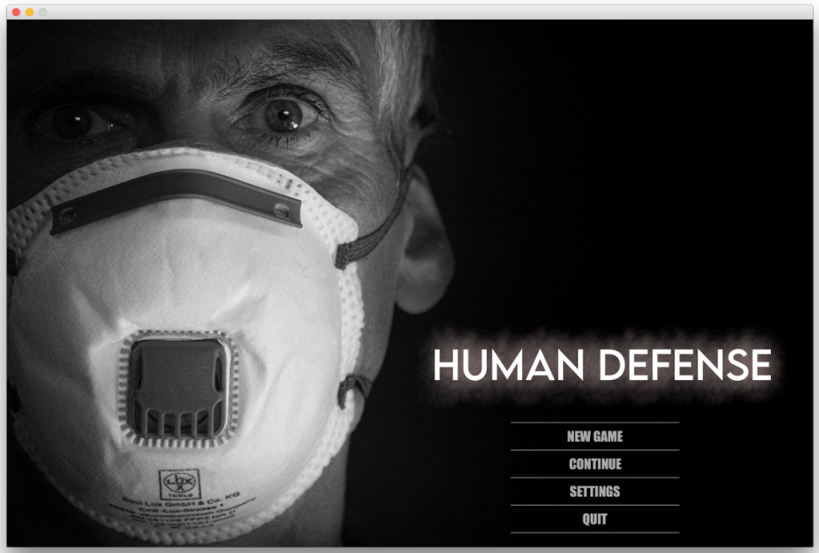
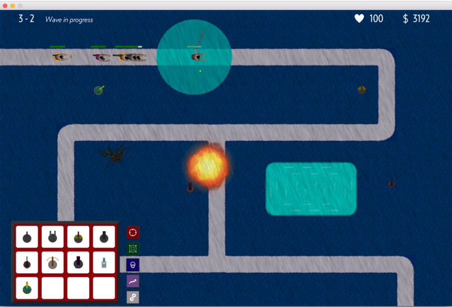
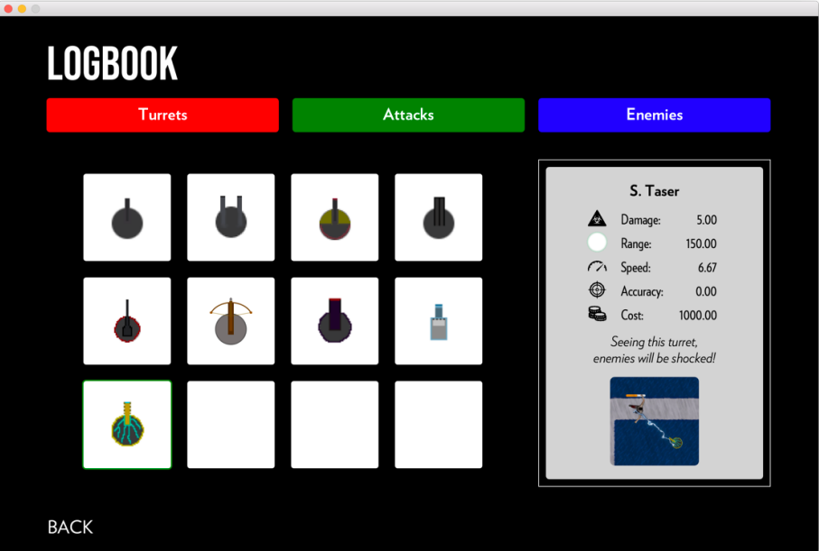
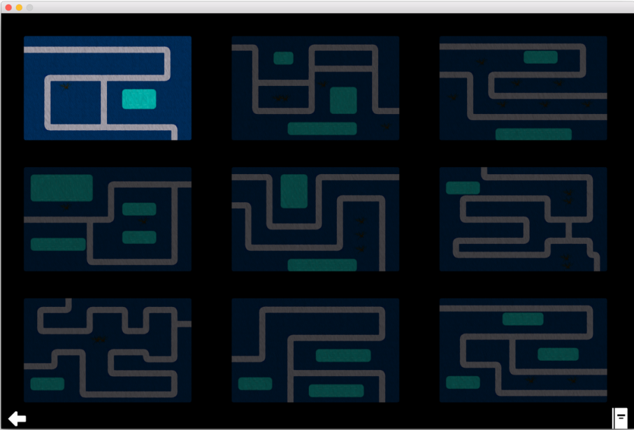
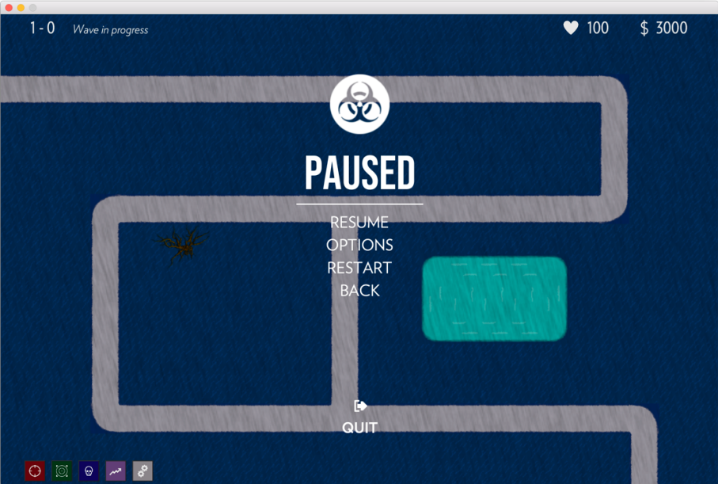
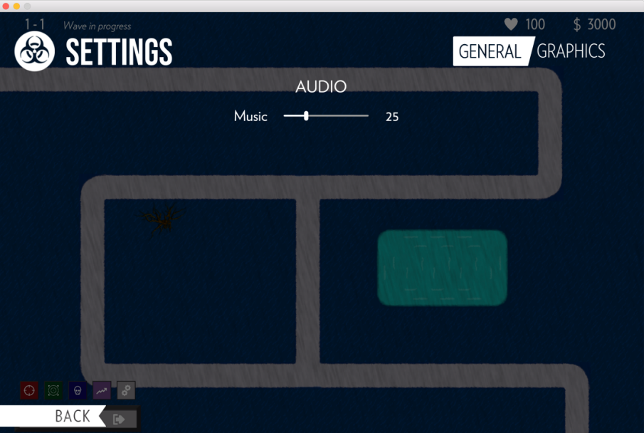

# Human Defense

  

* **Project Goal**: A Tower Defense built from scratch in Java.
* **Core Stack**: Java 11+ and JavaFX for rendering and UI.

---

## Gameplay and Content

  
  

* **Entities**: 9 turret types and 8 enemy types with unique behaviors (resurrection, scaling, or path shortcuts).
* **Dynamic Logbook**: A built-in bestiary displaying real-time unit stats (damage, range, speed) directly from the game code.
* **Progression System**: 9 maps with unique layouts and an exponential difficulty multiplier (health/spawn rates) per wave.

---

## Technical Implementation

  
  
  

* **Architecture**:
    * Inheritance-based design for turrets and enemies to share common logic (targeting, health, animation).
    * Centralized `GameInfo` class to sync gold, health, and progression across all systems.
* **Persistence and UI**:
    * **Save System**: Local text file storage for map unlocks and currency (easy to debug/edit).
    * **Custom GUI**: 5-tab interface with drag-and-drop turret placement and real-time range visualization.

---

## Running the Project

* **Requirement**: Java 11+ and JavaFX SDK.

